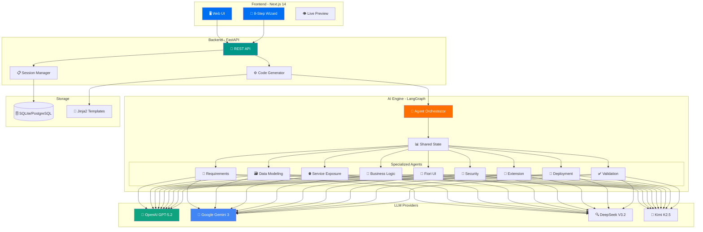
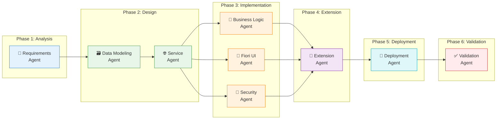
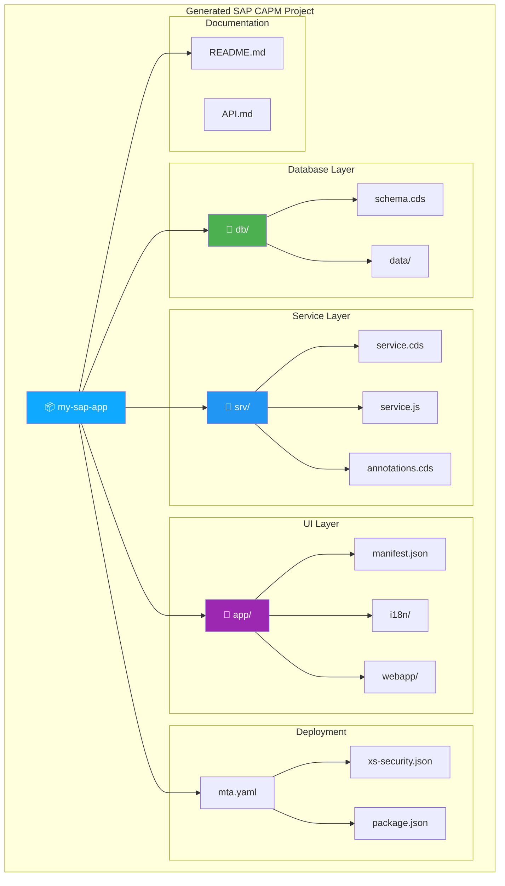
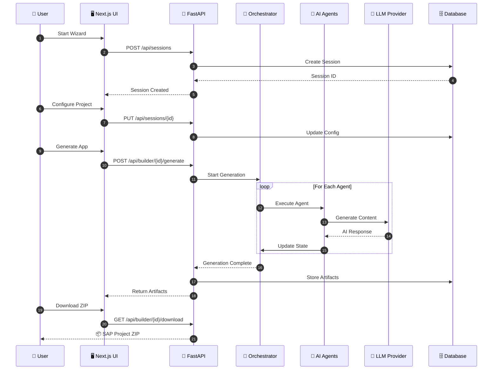
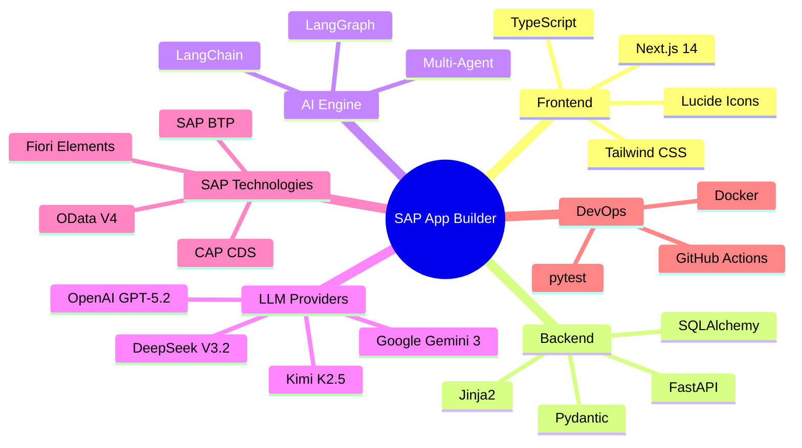
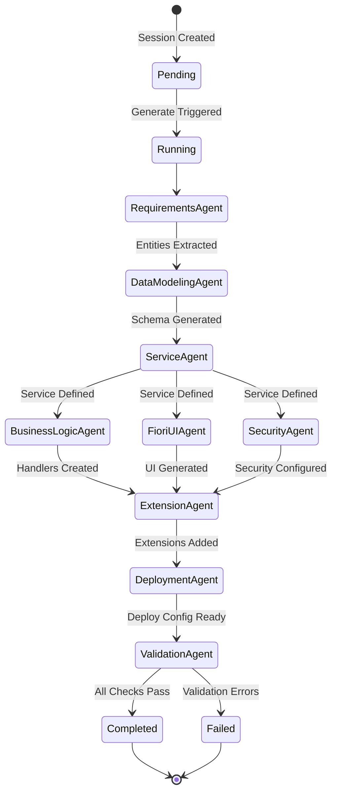
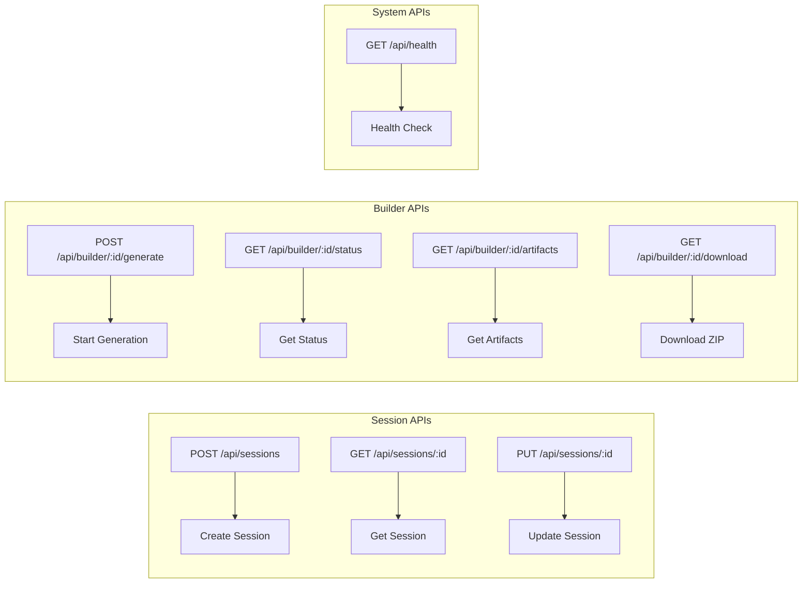

<](https://python.org)
[](https://fastapi.tiangolo.com)
[](https://nextjs.org)
[](https://langchain.com)
[](https://cap.cloud.sap)
[](LICENSE)

**🤖 AI-powered platform for generating production-ready SAP CAPM + SAP Fiori applications using LangGraph multi-agent orchestration**

[Quick Start](#-quick-start) •
[Architecture](#-architecture) •
[AI Agents](#-ai-agents) •
[API Reference](#-api-reference) •
[Contributing](#-contributing)

---

</div>

## ✨ Features

| Feature | Description |
|---------|-------------|
| 🤖 **9 Specialized AI Agents** | Each agent handles a specific aspect of SAP development |
| 🔄 **Multi-LLM Support** | OpenAI GPT-5.2, Google Gemini 3, DeepSeek V3.2, Kimi K2.5 |
| 🧙 **8-Step Wizard** | Intuitive UI to configure and generate your app |
| 📦 **Complete SAP Project** | CDS schemas, OData services, Fiori Elements UI |
| 🔐 **Security Configured** | xs-security.json with roles and scopes |
| 🚀 **Deployment Ready** | mta.yaml for SAP BTP deployment |
| 📚 **Auto Documentation** | README and developer guides generated |

---

## 🏗️ Architecture

### System Overview



### Agent Workflow Pipeline



### Generated SAP Project Structure



### Data Flow Sequence



### Technology Stack



---

## 🚀 Quick Start

### Prerequisites

| Requirement | Version | Purpose |
|-------------|---------|---------|
| Python | 3.11+ | Backend runtime |
| Node.js | 18+ | Frontend runtime |
| Docker | Latest | Containerization (optional) |
| LLM API Key | - | At least one provider |

### Installation

```bash
# Clone the repository
git clone https://github.com/your-org/sap-app-builder.git
cd sap-app-builder

# Backend setup
pip install -e .
copy .env.example .env  # Windows
# cp .env.example .env  # Linux/Mac

# Add your API keys to .env
# OPENAI_API_KEY=sk-...
# GOOGLE_API_KEY=AI...

# Start backend
python -m backend.main

# Frontend setup (new terminal)
cd frontend
npm install
npm run dev
```

### Access Points

| URL | Description |
|-----|-------------|
| 🖥️ http://localhost:3000 | Landing Page |
| 🧙 http://localhost:3000/builder | 8-Step Wizard |
| 📚 http://localhost:8000/api/docs | Swagger API Docs |
| ❤️ http://localhost:8000/api/health | Health Check |

### Docker Deployment

```bash
# Build and run with Docker Compose
docker-compose up -d

# View logs
docker-compose logs -f

# Stop
docker-compose down
```

---

## 🤖 AI Agents

### Agent Overview

| # | Agent | Icon | Purpose | Output |
|---|-------|------|---------|--------|
| 1 | **Requirements** | 📝 | Analyze domain & extract entities | Entity list, relationships |
| 2 | **Data Modeling** | 🗃️ | Generate CDS schemas | `db/schema.cds` |
| 3 | **Service Exposure** | 🌐 | Create OData services | `srv/service.cds` |
| 4 | **Business Logic** | 💼 | Write event handlers | `srv/service.js` |
| 5 | **Fiori UI** | 🎨 | Build Fiori Elements | `app/manifest.json` |
| 6 | **Security** | 🔐 | Configure authorization | `xs-security.json` |
| 7 | **Extension** | 🔧 | Add Clean Core hooks | Extension points |
| 8 | **Deployment** | 🚀 | Create deployment config | `mta.yaml` |
| 9 | **Validation** | ✅ | SAP compliance check | Validation report |

### Agent State Machine



---

## 📁 Project Structure

```
sap-app-builder/
├── 📁 backend/
│   ├── 📁 agents/           # LangGraph agents
│   │   ├── graph.py         # Agent orchestration graph
│   │   ├── state.py         # Shared state definition
│   │   ├── requirements.py  # Requirements analysis
│   │   ├── data_modeling.py # CDS schema generation
│   │   ├── service_exposure.py
│   │   ├── business_logic.py
│   │   ├── fiori_ui.py
│   │   ├── security.py
│   │   ├── extension.py
│   │   ├── deployment.py
│   │   └── validation.py
│   ├── 📁 api/              # FastAPI routes
│   │   ├── builder.py       # Generation endpoints
│   │   └── sessions.py      # Session management
│   ├── 📁 models/           # SQLAlchemy models
│   │   ├── session.py
│   │   ├── artifact.py
│   │   └── user.py
│   ├── 📁 templates/        # Jinja2 templates
│   │   └── 📁 jinja_templates/
│   │       ├── 📁 cds/      # CDS templates
│   │       ├── 📁 fiori/    # Fiori templates
│   │       ├── 📁 deployment/
│   │       └── 📁 security/
│   ├── main.py              # FastAPI app
│   ├── config.py            # Configuration
│   └── database.py          # DB connection
├── 📁 frontend/
│   ├── 📁 src/
│   │   ├── 📁 app/
│   │   │   ├── page.tsx     # Landing page
│   │   │   └── 📁 builder/
│   │   │       └── page.tsx # Wizard
│   │   ├── 📁 components/
│   │   │   ├── WizardLayout.tsx
│   │   │   └── AgentProgress.tsx
│   │   └── 📁 lib/
│   │       └── api.ts       # API client
│   ├── package.json
│   └── tailwind.config.js
├── 📁 tests/
│   ├── conftest.py
│   └── test_agents.py
├── .env.example
├── docker-compose.yml
├── Dockerfile
├── pyproject.toml
└── README.md
```

---

## 🔌 API Reference

### Endpoints



### Quick Examples

```bash
# Create session
curl -X POST http://localhost:8000/api/sessions \
  -H "Content-Type: application/json" \
  -d '{"project_name": "My SAP App"}'

# Start generation
curl -X POST http://localhost:8000/api/builder/{session_id}/generate \
  -H "Content-Type: application/json" \
  -d '{"llm_provider": "openai", "llm_model": "gpt-5.2"}'

# Download project
curl -O http://localhost:8000/api/builder/{session_id}/download
```

---

## 🔑 Environment Variables

| Variable | Required | Default | Description |
|----------|----------|---------|-------------|
| `OPENAI_API_KEY` | ⭐ | - | OpenAI API key |
| `GOOGLE_API_KEY` | ⭐ | - | Google Gemini API key |
| `DEEPSEEK_API_KEY` | ⭐ | - | DeepSeek API key |
| `KIMI_API_KEY` | ⭐ | - | Kimi/Moonshot API key |
| `DEFAULT_LLM_PROVIDER` | ❌ | `openai` | Default LLM provider |
| `DEFAULT_LLM_MODEL` | ❌ | `gpt-5.2` | Default model |
| `DATABASE_URL` | ❌ | `sqlite:///./app.db` | Database connection |
| `ENVIRONMENT` | ❌ | `development` | Environment mode |

> ⭐ At least one LLM API key is required

---

## 🧪 Testing

```bash
# Install dev dependencies
pip install -e ".[dev]"

# Run all tests
pytest backend/tests -v

# Run with coverage
pytest backend/tests --cov=backend --cov-report=html

# Run specific test
pytest backend/tests/test_agents.py -v
```

---

## 🤝 Contributing

1. Fork the repository
2. Create a feature branch (`git checkout -b feature/amazing-feature`)
3. Commit changes (`git commit -m 'Add amazing feature'`)
4. Push to branch (`git push origin feature/amazing-feature`)
5. Open a Pull Request

---

## 📄 License

This project is licensed under the MIT License - see the [LICENSE](LICENSE) file for details.

---

<div align="center">

**Made with ❤️ for SAP Developers**

[](https://github.com/your-org/sap-app-builder)

</div>
]]>
